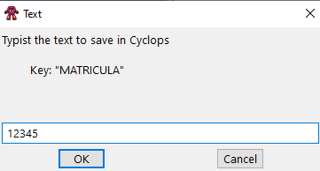
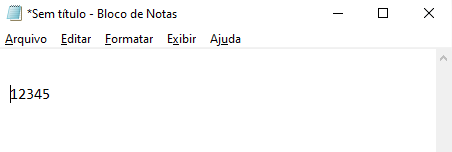

# Cyclops

- [Cyclops](#cyclops)
  - [Quando posso utilizar o Cyclops?](#quando-posso-utilizar-o-cyclops)
  - [Experimente Rápido](#experimente-rápido)
  - [Texto Rápido](#texto-rápido)
    - [Associação com Letras / Números](#associação-com-letras--números)
      - [Associar Texto](#associar-texto)
      - [Escrever Texto Associado](#escrever-texto-associado)
    - [Associação com uma Chave Personalizada](#associação-com-uma-chave-personalizada)
      - [Salvar Texto a Chave Personalizada](#salvar-texto-a-chave-personalizada)
      - [Recuperar Texto associado a Chave](#recuperar-texto-associado-a-chave)
  - [Executar Arquivos/URL](#executar-arquivosurl)
    - [Observações](#observações)
    - [Associar Arquivo/URL](#associar-arquivourl)
    - [Executar Arquivo/URL](#executar-arquivourl)
  - [Windows Switcher / Alternador de Janelas](#windows-switcher--alternador-de-janelas)
    - [Observações](#observações-1)
    - [Teclado Númerico | Numpad](#teclado-númerico--numpad)
    - [Associar uma Janela](#associar-uma-janela)
    - [Ativar Janela](#ativar-janela)
  - [Outras Funções](#outras-funções)
  - [LICENÇA MIT](#licença-mit)

**Cyclops** é um aplicativo desenvolvido em [AutoHotkey](https://www.autohotkey.com) que tem o objetivo de tornar mais rápido e eficiente a troca entre janelas, memorização de texto e execução rápida de arquivos e endereços web.

## Quando posso utilizar o Cyclops?

- Quando você deseja armazenar alguma informação onde digitaria em formulários.
  - Nome
  - E-mail
  - Usuário
  - Matrícula
- Para desenvolvedores: você pode utilizar para armazenar dados de usuário e senha em testes
- Para desenvolvedores: armazenar _select's_ que você utiliza com frequencia ("select precisa estar em apenas 1 linha")
- Para desenvolvedores: armazenar _comandos prompt_: "git log --graph --oneline"
- Quando você deseja alternar entre janelas do Windows, mais rápido que o <kbd>Alt</kbd> + <kbd>Tab</kbd> sonharia ser capaz de fazer.
- Quero abrir um programa mais rápido, com apenas um atalho, sem precisar clicar no atalho da Área de Trabalho ou ir ao Menu Iniciar

 

## Experimente Rápido

1. <kbd>Alt</kbd> + <kbd>Win</kbd> + <kbd>C</kbd> - Digite um texto qualquer.

2. <kbd>Ctrl</kbd> + <kbd>Alt</kbd> + <kbd>1</kbd> - Abrir o Bloco de Notas.

3. <kbd>Alt</kbd> + <kbd>Shift</kbd> + <kbd>C</kbd> - Será digitado o texto que você associou a Letra C.

 

## Texto Rápido

### Associação com Letras / Números

- Utilizando as Letras [A..Z] e Números [0..9] como Chaves

Com esta funcionalidade você pode armazenar um texto, frase, palavra, números ou letras, associando com uma tecla, e recuperar rapidamente esta informação através de atalhos.

#### Associar Texto

| Atalho                                         | Descrição                                   |
| ---------------------------------------------- | ------------------------------------------- |
| <kbd>Alt</kbd> + <kbd>Win</kbd> + <kbd>A</kbd> | Associa um texto a Letra A                  |
| <kbd>Alt</kbd> + <kbd>Win</kbd> + <kbd>B</kbd> | Associa um texto a Letra B                  |
| <kbd>Alt</kbd> + <kbd>Win</kbd> + <kbd>C</kbd> | Associa um texto a Letra C                  |
| ...                                            | Associa com cada Letra do Teclado           |
| <kbd>Alt</kbd> + <kbd>Win</kbd> + <kbd>Z</kbd> | Associa um texto a Letra Z                  |
| <kbd>Alt</kbd> + <kbd>Win</kbd> + <kbd>1</kbd> | Associa um texto a Tecla 1                  |
| <kbd>Alt</kbd> + <kbd>Win</kbd> + <kbd>2</kbd> | Associa um texto a Tecla 2                  |
| ...                                            | Associa um texto com cada Número do Teclado |
| <kbd>Alt</kbd> + <kbd>Win</kbd> + <kbd>0</kbd> | Associa um texto a Tecla 0                  |

#### Escrever Texto Associado

| Atalho                                         | Descrição                                         |
| ---------------------------------------------- | ------------------------------------------------- |
| <kbd>Alt</kbd> + <kbd>Win</kbd> + <kbd>A</kbd> | Escreve texto associado a Letra A                 |
| <kbd>Alt</kbd> + <kbd>Win</kbd> + <kbd>B</kbd> | Escreve texto associado a Letra B                 |
| <kbd>Alt</kbd> + <kbd>Win</kbd> + <kbd>C</kbd> | Escreve texto associado a Letra C                 |
| ...                                            | Escreve texto associado com cada Letra do Teclado |
| <kbd>Alt</kbd> + <kbd>Win</kbd> + <kbd>Z</kbd> | Escreve texto associado a Letra Z                 |
| <kbd>Alt</kbd> + <kbd>Win</kbd> + <kbd>1</kbd> | Escreve texto associado a Tecla 1                 |
| <kbd>Alt</kbd> + <kbd>Win</kbd> + <kbd>2</kbd> | Escreve texto associado a Tecla 2                 |
| ...                                            | Escreve texto associado com Número do Teclado     |
| <kbd>Alt</kbd> + <kbd>Win</kbd> + <kbd>0</kbd> | Escreve texto associado a Tecla 0                 |

### Associação com uma Chave Personalizada

Talvez você queira associar um Texto a uma Palavra específica para seu contexto. Neste caso você pode armazenar uma chave personalizada.

#### Salvar Texto a Chave Personalizada

<kbd>Ctrl</kbd> + <kbd>Alt</kbd> + <kbd>Win</kbd> + <kbd>I</kbd> | Faz a associação com uma chave personalizada

Você pode utilizar a palavra "Matrícula" como **Chave** e associar o Texto "12345"

- Informando a Chave Personalizada

  

- Informando o Texto que será associado a esta Chave

  

_Matricula=12345_

#### Recuperar Texto associado a Chave

Para recuperar esta informação você pode utilizar o atalho

<kbd>Ctrl</kbd> + <kbd>Alt</kbd> + <kbd>Win</kbd> + <kbd>O</kbd> | Escreve o texto associado a chave personalizada

- Informando a Chave Personalizada

  

- Será digitado, na Tela que estiver ativa, o texto associado a Chave

  

 

## Executar Arquivos/URL

Com o Cyclops você consegue associar um arquivo [\*.exe, \*.pdf, \*.xls] ou um endereço da web [https://google.com.br] para abrir automaticamente utilizando apenas um atalho

### Observações

- Para arquivos é necessário informar o caminho completo do arquivos
- Também funciona com o path (endereço completo) dos atalhos na área de trabalho
- Para endereço da web você deve informar com o "HTTPS://" na frente
- Páginas da Internet serão abertas no navegador padrão do sistema

### Associar Arquivo/URL

| Atalho                                          | Descrição                                         |
| ----------------------------------------------- | ------------------------------------------------- |
| <kbd>Ctrl</kbd> + <kbd>Win</kbd> + <kbd>A</kbd> | Associa um arquivo/url a Letra A                  |
| <kbd>Ctrl</kbd> + <kbd>Win</kbd> + <kbd>B</kbd> | Associa um arquivo/url a Letra B                  |
| <kbd>Ctrl</kbd> + <kbd>Win</kbd> + <kbd>C</kbd> | Associa um arquivo/url a Letra C                  |
| ...                                             | Associa um arquivo/url com cada Letra do Teclado  |
| <kbd>Ctrl</kbd> + <kbd>Win</kbd> + <kbd>Z</kbd> | Associa um arquivo/url a Letra Z                  |
| <kbd>Ctrl</kbd> + <kbd>Win</kbd> + <kbd>1</kbd> | Associa um arquivo/url a Tecla 1                  |
| <kbd>Ctrl</kbd> + <kbd>Win</kbd> + <kbd>2</kbd> | Associa um arquivo/url a Tecla 2                  |
| ...                                             | Associa um arquivo/url com cada Número do Teclado |
| <kbd>Ctrl</kbd> + <kbd>Win</kbd> + <kbd>0</kbd> | Associa um arquivo/url a Tecla 0                  |

### Executar Arquivo/URL

| Atalho                                          | Descrição                                                  |
| ----------------------------------------------- | ---------------------------------------------------------- |
| <kbd>Ctrl</kbd> + <kbd>Win</kbd> + <kbd>A</kbd> | Executa um arquivo/url associado a Letra A                 |
| <kbd>Ctrl</kbd> + <kbd>Win</kbd> + <kbd>B</kbd> | Executa um arquivo/url associado a Letra B                 |
| <kbd>Ctrl</kbd> + <kbd>Win</kbd> + <kbd>C</kbd> | Executa um arquivo/url associado a Letra C                 |
| ...                                             | Executa um arquivo/url associado com cada Letra do Teclado |
| <kbd>Ctrl</kbd> + <kbd>Win</kbd> + <kbd>Z</kbd> | Executa um arquivo/url associado a Letra Z                 |
| <kbd>Ctrl</kbd> + <kbd>Win</kbd> + <kbd>1</kbd> | Executa um arquivo/url associado a Tecla 1                 |
| <kbd>Ctrl</kbd> + <kbd>Win</kbd> + <kbd>2</kbd> | Executa um arquivo/url associado a Tecla 2                 |
| ...                                             | Executa um arquivo/url associado com Número do Teclado     |
| <kbd>Ctrl</kbd> + <kbd>Win</kbd> + <kbd>0</kbd> | Executa um arquivo/url associado a Tecla 0                 |

 

## Windows Switcher / Alternador de Janelas

Você pode alterar rapidamente entre janelas do Windows sem utilizar o <kbd>Alt</kbd> + <kbd>Tab</kbd> e indo direto para a janela que você deseja, sem precisar ficar escolhendo em uma lista.

### Observações

- Esta funcionalidade está habilitada apenas para o Teclado Número (Numpad).
- Você pode associar janelas do Windows aos números do Teclado Numérico de 0 a 9.
- Precisa informar o título ou parte do título da janela que você deseja associar.
- É case-sensitive, considera diferença entre maíuscula e mínuscula.
- Funciona com parte do Título da Janela. Não precisa ser o título completo.
- Há um atalho, em **Outras Funções** para copiar o título da janela ativa.

 

### Teclado Númerico | Numpad

### Associar uma Janela

| Associar Arquivo / URL                                | Descrição                                 |
| ----------------------------------------------------- | ----------------------------------------- |
| <kbd>Win</kbd> + <kbd>Alt</kbd> + <kbd>NUMPAD 0</kbd> | Associa uma janela do Windows ao Número 0 |
| <kbd>Win</kbd> + <kbd>Alt</kbd> + <kbd>NUMPAD 1</kbd> | Associa uma janela do Windows ao Número 1 |
| ...                                                   |                                           |
| <kbd>Win</kbd> + <kbd>Alt</kbd> + <kbd>NUMPAD 9</kbd> | Associa uma janela do Windows ao Número 2 |

### Ativar Janela

| Associar Arquivo / URL                                 | Descrição                                               |
| ------------------------------------------------------ | ------------------------------------------------------- |
| <kbd>Win</kbd> + <kbd>Ctrl</kbd> + <kbd>NUMPAD 0</kbd> | Ativa a janela do Windows com Título associado Número 0 |
| <kbd>Win</kbd> + <kbd>Ctrl</kbd> + <kbd>NUMPAD 1</kbd> | Ativa a janela do Windows com Título associado Número 1 |
| ...                                                    |                                                         |
| <kbd>Win</kbd> + <kbd>Ctrl</kbd> + <kbd>NUMPAD 9</kbd> | Ativa a janela do Windows com Título associado Número 9 |

`WIN + CTRL + [NUMPAD 0..9]` - Ativa a janela que possui o nome cadastrado.

 

## Outras Funções

| Atalho                                                             | Descrição                      |
| ------------------------------------------------------------------ | ------------------------------ |
| <kbd>Ctrl</kbd> + <kbd>Alt</kbd> + <kbd>NUMPAD 1</kbd>             | Abre o bloco de notas          |
| <kbd>Ctrl</kbd> + <kbd>Alt</kbd> + <kbd>1</kbd>                    | Abre o bloco de notas          |
| <kbd>Ctrl</kbd> + <kbd>Alt</kbd> + <kbd>NUMPAD 2</kbd>             | Abre a calculadora             |
| <kbd>Ctrl</kbd> + <kbd>Alt</kbd> + <kbd>2</kbd>                    | Abre a calculadora             |
| <kbd>Ctrl</kbd> + <kbd>Win</kbd> + <kbd>Shift</kbd> + <kbd>N</kbd> | Copia o título da janela ativa |
| <kbd>Ctrl</kbd> + <kbd>Win</kbd> + <kbd>Shift</kbd> + <kbd>W</kbd> | Ativa todas as janelas abertas |
| <kbd>Ctrl</kbd> + <kbd>Win</kbd> + <kbd>Shift</kbd> + <kbd>C</kbd> | Fecha todas as janelas abertas |
| <kbd>Ctrl</kbd> + <kbd>Win</kbd> + <kbd>Alt</kbd> + <kbd>8</kbd>   | Reinicia o Sistema Operacional |
| <kbd>Ctrl</kbd> + <kbd>Win</kbd> + <kbd>Alt</kbd> + <kbd>5</kbd>   | Hiberna o Sistema Operacional  |
| <kbd>Ctrl</kbd> + <kbd>Win</kbd> + <kbd>Alt</kbd> + <kbd>0</kbd>   | Desliga o Sistema Operacional  |

 

## LICENÇA MIT

Este aplicativo foi desenvolvido para facilitar meu trabalho, me tornando mais produtivo e eficiente. Espero que ele possa ser tão útil para você quanto é para mim.
É totalmente gratuito e está sob a Licença MIT, podendo ser utilizado e distribuido livremente.

**Enjoy It!!!**

 

Icons made by <a href="https://www.flaticon.com/authors/smashicons" title="Smashicons">Smashicons</a> from <a href="https://www.flaticon.com/" title="Flaticon">www.flaticon.com</a>

